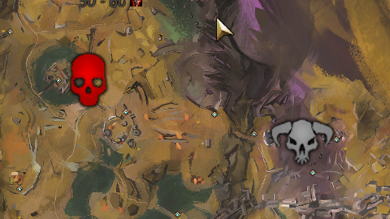
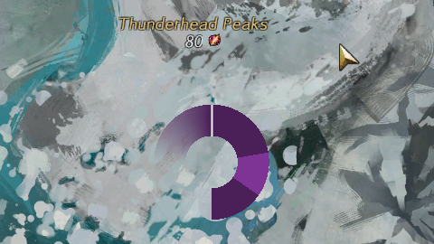
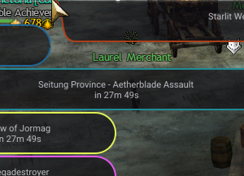

# World Events

> A live event tracker for **Guild Wars 2**, built for the [Nexus](https://raidcore.gg/Nexus) addon framework.

> [!WARNING]
> **AI Notice** - World Events was developed with heavy use of AI assistance, specifically [Claude](https://claude.ai) by Anthropic. From architecture decisions and refactoring to bug hunting and documentation, Claude was a core part of the development process.

> [!NOTE]
> **Requirements & Installation**
>
> - Requires the [Nexus](https://raidcore.gg/Nexus) addon loader and Guild Wars 2
> - Install it from the Nexus Library in-game, or download the latest `.dll` from [Releases](../../releases) and place it in your Nexus addons folder (`Guild Wars 2/addons`)
> - In Nexus, find World Events in the addon list and press **Load**

---

## What is World Events?

World Events keeps a running account of every world boss, invasion, and meta chain across Tyria, and marks it directly on your map - no wiki tab required.

---

## All Features at a Glance

- **World Clock** - everything runs on the game's own schedule, nothing to configure
- **Map Markers** - bosses, invasions, Anomalies & convergences shown live on the map
- **Meta Rings** - full meta chains drawn as arcs that fill through their cycle
- **Subscriptions Bar** - a slim strip showing your watchlist over the next two hours
- **Watchlist Window** - a standalone window for a deeper look at what you follow
- **Categories** - group events into your own categories, drag-and-drop to sort
- **Daily Tracking** - optional API key marks off bosses & chests claimed today
- **Weekly Vault** - cross-checks this week's Wizard's Vault objectives against events
- **Chat Codes** - copy a waypoint code to clipboard for any event or chain step
- **Custom Icons** - swap the plain marker for a tintable icon of your choosing
- **Drag to Move** - reposition any marker on the map instead of typing coordinates
- **Safe Storage** - customization saved locally and merged safely across updates

---

## Event Types

Two kinds of events are tracked, each rendered differently on the map so you can tell at a glance what you're looking at.

| Type | Covers | Shown as |
|---|---|---|
| **Basic Events** | World bosses, invasions, Ley Line Anomalies, convergences | Status-colored marker |
| **Cyclic Events** | Full map meta chains - Central Tyria, Heart of Thorns, Path of Fire, Living World, End of Dragons, Secrets of the Obscure, Janthir Wilds | Ring that fills through its cycle |

<table>
  <tr>
    <td align="center"><b>Basic Event, active</b> </td>
    <td align="center"><b>Cyclic ring, mid-cycle</b> </td>
    <td align="center"><b>Subscriptions bar</b> </td>
  </tr>
</table>

---

## Subscriptions & Watchlist

Subscribe to any basic event, or to a single occurrence within a meta chain, to keep it close at hand.

- The **Subscriptions Bar** shows a rolling two-hour window of what you follow
- The **Watchlist Window** gives the fuller picture, for a deeper look at everything you've subscribed to
- Active weekly **Wizard's Vault** objectives get their own small marker, until the objective is complete for the week

---

## Daily Tracking & the Official GW2 API

Add an official GW2 API key with the **progression** permission to mark off the 13 classic world bosses and the Hero's Choice Chests already claimed today.

Without a key, everything else still works exactly the same - only the "done today" marker stays quiet.

---

## Categories & Customization

- Group events into your own categories, and drag-and-drop to sort them
- Swap the default marker for a tintable icon of your choosing
- Drag markers directly on the map to reposition them, instead of typing coordinates
- Copy a waypoint chat code for any event or chain step straight to your clipboard
- All customization is saved locally and merged safely across updates
