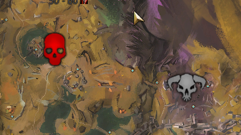
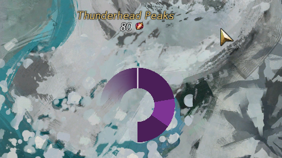
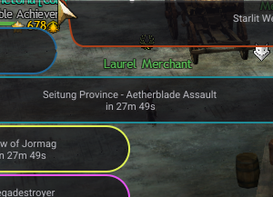

# World Events

> A live event tracker for **Guild Wars 2**, built for the [Nexus](https://raidcore.gg/Nexus) addon framework.

> [!WARNING]
> **AI Notice** - World Events was developed with heavy use of AI assistance, specifically [Claude](https://claude.ai) by Anthropic. From architecture decisions and refactoring to bug hunting and documentation, Claude was a core part of the development process.

> [!NOTE]
> **Requirements & Installation**
>
> - Requires the [Nexus](https://raidcore.gg/Nexus) addon loader and Guild Wars 2
> - Install it from the Nexus Library in-game, or download the latest `.dll` from [Releases](../../releases) and place it in your Nexus addons folder (`Guild Wars 2/addons`)
> - In Nexus, find World Events in the addon list and press **Load**
> - Chinese text needs a CJK-capable font loaded in Nexus (for example Sarasa Gothic)

---

## What is World Events?

World Events keeps a running account of every world boss, invasion, and meta chain across Tyria, and marks it directly on your map. Events with no fixed schedule, like Treasure Mushrooms, are covered by player reports shared through a small relay server. No wiki tab required.

---

## All Features at a Glance

- **World Clock** - everything runs on the game's own schedule, nothing to configure
- **Map Markers** - bosses, invasions, Ley-Line Anomalies, fractal incursions and festival events shown live on the map
- **Meta Rings** - full meta chains drawn as arcs that fill through their cycle
- **Live Events** - player-reported events (Treasure Mushrooms and more) with a report button and region-wide toasts
- **Subscriptions Bar** - a slim strip showing your watchlist over the next two hours
- **Watchlist Window** - a standalone window for a deeper look at what you follow
- **Notifications** - toast popups and an optional sound, per event, with adjustable width, position and stack direction
- **Categories** - group events into your own categories, drag-and-drop to sort
- **Daily Tracking** - optional API key marks off bosses and chests claimed today, and you can tick off anything else by hand
- **Weekly Vault** - surfaces the events that count toward this week's Wizard's Vault objectives
- **Chat Codes** - paste a waypoint code into the chat channel of your choice
- **Custom Icons and Textures** - tintable marker icons, ring textures and a Texture Whitener to prepare your own
- **Pin to Screen** - fix a marker or ring to a spot on your screen, like a HUD timer
- **Drag to Move** - reposition any marker by dragging it on the map, no coordinates to type
- **Five Languages** - English, German, French, Spanish and Chinese, with a separate language for event names
- **PvP/WvW Aware** - choose what stays visible in competitive modes
- **Safe Storage** - customization saved locally and merged safely across updates

---

## Event Types

Three kinds of events are tracked, each shown differently so you can tell at a glance what you're looking at.

| Type | Covers | Shown as |
|---|---|---|
| **Basic Events** | World bosses, Ley-Line Anomalies, invasions, fractal incursions, festival events, instanced content | Status-colored marker |
| **Cyclic Events** | Map meta chains from Living World, Heart of Thorns, Path of Fire, Icebrood Saga, End of Dragons, Secrets of the Obscure, Janthir Wilds, Visions of Eternity and the Festival of the Four Winds | Ring that fills through its cycle |
| **Live Events** | Player-reported events without a schedule: Treasure Mushrooms and other rare spawns | Report button, reports window, optional map rings |

<table>
  <tr>
    <td align="center"><b>Basic Event, active</b><br></td>
    <td align="center"><b>Cyclic ring, mid-cycle</b><br></td>
    <td align="center"><b>Subscriptions bar</b><br></td>
  </tr>
</table>

### Basic Events

Each marker takes the color of its state: active, starting soon, or waiting. Colors and size are yours to change.
Markers grow as you zoom into the map, and an optional time filter hides upcoming events that start later than a window you choose (15 minutes up to 12 hours). Active events always stay visible.

### Cyclic Events

A ring shows the whole cycle of a map meta, with a fixed "now" hand at the top. Upcoming slots fade in from the right, finished ones fade out behind the hand. You choose how far ahead and back the ring reaches, the ring's radius and thickness, the hand color, and whether the past fades. The ring can carry three optional textures: a hand image, an edge band and a fill decal. Slots inside a group can have different start times.

### Live Events

GW2 publishes no schedule for these, so players report them. Turn the feature on in the **Live** tab of the settings window.

- Near a live event, a **report button** appears in the upper-right corner. Left-click reports the event as active, right-click only opens the recent reports. Drag the button to a spot you like (tick **Move button** in the Live tab)
- The **reports window** lists every live event on your current map instance, with the latest report times. It can stay open, and it can be locked into a bare HUD
- **Map rings** mark where each live event happens while the full-screen map is open
- **Region-wide toasts** notify you when someone on your region (EU or NA) reports a subscribed event, no matter which map you're on. This needs a GW2 API key, which is how the addon tells the regions apart
- Reports are **anonymous** by default. If you switch on name sharing, your character name goes with each report, and anyone whose toast it triggers can whisper you with one click. Each event can also be set to "Only named", "Done today" (mutes it until the daily reset) and its own subscribe box
- The **Info** tab has a debug window listing every message on the live connection

The roster has 14 events: eight Treasure Mushrooms plus Rhendak the Crazed, Dredge Commissar, Foulbear Kraal, Eye of Zhaitan, Statue of Lyssa and Risen High Wizard.

Two small Cloudflare Workers carry the reports, see [`server/`](server/README.md) (one Durable Object per map shard) and [`server-notify/`](server-notify/README.md) (one per region for toasts).

---

## Subscriptions & Notifications

Subscribe to any basic event, or to a single occurrence within a meta chain, to keep it close at hand. Each entry has a notify level you raise with one click: subscribed (silent), plus toast, plus sound.

- The **Subscriptions Bar** shows a rolling two-hour window along the top or bottom edge of the screen. Segments pop out under the mouse, and the bar can keep clear of your own GW2 UI corners
- The **Watchlist Window** gives the fuller picture, with a live countdown for each entry
- **Toasts** warn you a set number of minutes before an event starts, and optionally the moment it goes live. Set their width, position and stack direction in the General tab, with a live preview outline while you adjust
- **Sounds** come from `.wav` files you drop into the `sounds` folder of the addon directory
- **Click** a bar segment, row or toast to paste its waypoint code. **Right-click** to mark it done for today or open the settings for that entry
- Active weekly Wizard's Vault objectives get their own marker, until the objective is complete for the week

**Paste to** sets the chat channel that waypoint codes go into: current chat, Say, Party, Squad, Guild (represented), Guild 1 to 5, Map, or a whisper to yourself. If the Better Chat addon is loaded with its `/self` command enabled, that option appears too.

---

## Daily Tracking & the Official GW2 API

Add an official GW2 API key with the **account** and **progression** permissions in **General > Account and tracking**. The addon then knows:

- which of the 13 classic world bosses you already killed today
- which Hero's Choice Chests you already claimed today (the 8 Heart of Thorns and Path of Fire map meta chests)
- this week's Wizard's Vault objectives and your progress on them
- your home world, which sets your region for live event toasts

Finished bosses and chests drop off the watchlist on their own. You can also mark any event or slot as done by hand, and every mark clears at the daily reset (UTC).

The key is stored encrypted in `settings.ini`. A status line next to the key field shows whether the key works.

Without a key, everything else still works exactly the same. Only the "done today" markers, the vault tracking and region-wide live toasts stay quiet.

---

## Weekly Vault

The addon cross-checks this week's Wizard's Vault objectives against its own events. Core boss objectives match by boss name automatically. Meta objectives use a table in `src/integration/weekly_vault.cpp`, which the build validates against the cyclic roster. Matching events show up on the watchlist, the bar and as toasts with a thin red border, and stop once the objective is complete. You can switch this off or change its color in the settings.

---

## Customization

- **Categories** - group events into your own categories, rename them, and drag-and-drop to sort
- **Add your own** - create custom basic events and cyclic groups in Deep mode, or edit the built-in ones
- **Pin to screen** - fix a Basic Event or Cyclic Group to a spot on your screen. Pinned entries also show on PvP and WvW maps
- **Drag to move** - press **Drag** next to a Location field, then drag the marker on the map. Press **Stop** when done
- **Icons and textures** - put PNG files into the `textures` folder of the addon directory and pick them from the dropdowns. Marker icons are tinted at draw time, so they need a neutral gray shape with alpha. The **Texture Whitener** in the Events tab converts a colored PNG into that form and saves it as `<name>_white.png`
- **Competitive mode** - hide the Subscriptions window, bar, toasts and pinned markers separately while you're in PvP or WvW
- **Languages** - the UI follows the Nexus language. Event, group and slot names can use their own language in the Events tab

### Where your data lives

Everything sits in the addon directory (`Guild Wars 2/addons/WorldEvents`):

| File or folder | Holds |
|---|---|
| `settings.ini` | All settings, API key encrypted |
| `events.json` | Events, groups, categories, subscriptions, done-today marks |
| `textures/` | Icons and ring textures |
| `sounds/` | `.wav` notification sounds |

---

## Building from Source

The addon is C++17 and builds with CMake. Dependencies (Dear ImGui, Mumble, Nexus, nlohmann/json) are fetched at configure time.

```bash
# MinGW (default)
cmake -B build/mingw
cmake --build build/mingw

# MSVC ABI through clang-cl and an xwin sysroot
cmake -B build/msvc -G Ninja -DCMAKE_TOOLCHAIN_FILE=cmake/toolchain-msvc-clangcl.cmake -DXWIN_SYSROOT=~/.xwin
cmake --build build/msvc
```

The relay hosts are not part of the repository. Generate both headers from your own Worker URLs before building:

```bash
python3 tools/generate_host_config.py "your-worker.your-subdomain.workers.dev" > src/networking/host_config.h
python3 tools/generate_host_config.py "your-worker-notify.your-subdomain.workers.dev" Notify > src/networking/notify_host_config.h
```

Both files are gitignored. The build also embeds `resources/textures/*.png`, regenerates the localization tables and changelog from the CSV files in `resources/localization/`, validates the weekly vault table, and bumps the revision number.

| Path | Contents |
|---|---|
| `src/core` | Settings, subscriptions, localization, sound |
| `src/events` | Event data, categories, storage, migration, daily tracking |
| `src/overlay` | Map markers and cyclic rings |
| `src/ui` | Settings window tabs, watchlist window, bar, toasts, changelog |
| `src/integration` | GW2 API, weekly vault, Better Chat |
| `src/networking` | Live event WebSocket clients |
| `server/`, `server-notify/` | The two Cloudflare Workers |
| `tools/` | Generators, comment checks, version bump |

Code comments follow [`COMMENT_STYLE.md`](COMMENT_STYLE.md).

---

## Changelog

A selected history is in `resources/localization/version_history.csv`, and the addon shows a "What's New" window after each update.
The full changelog can be found here on GitHub.
